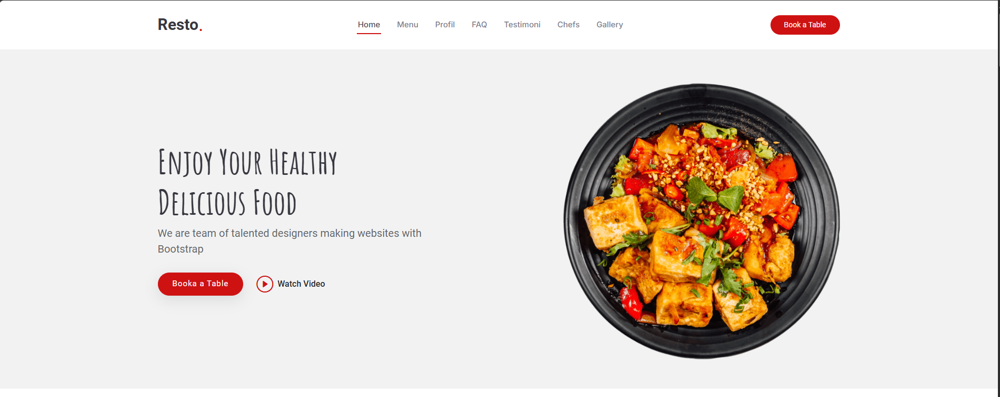
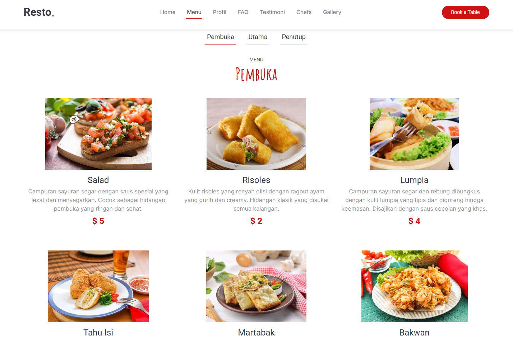
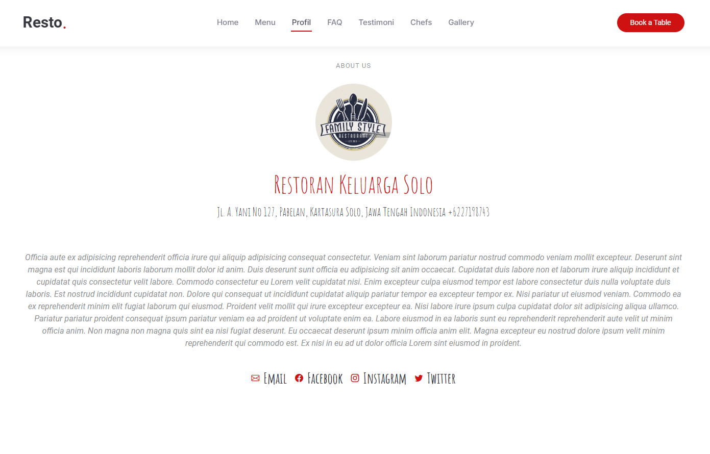
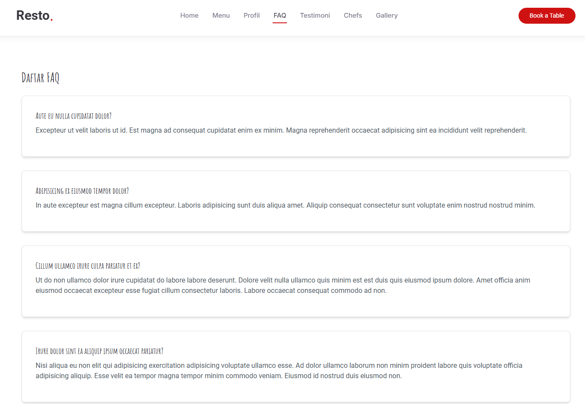
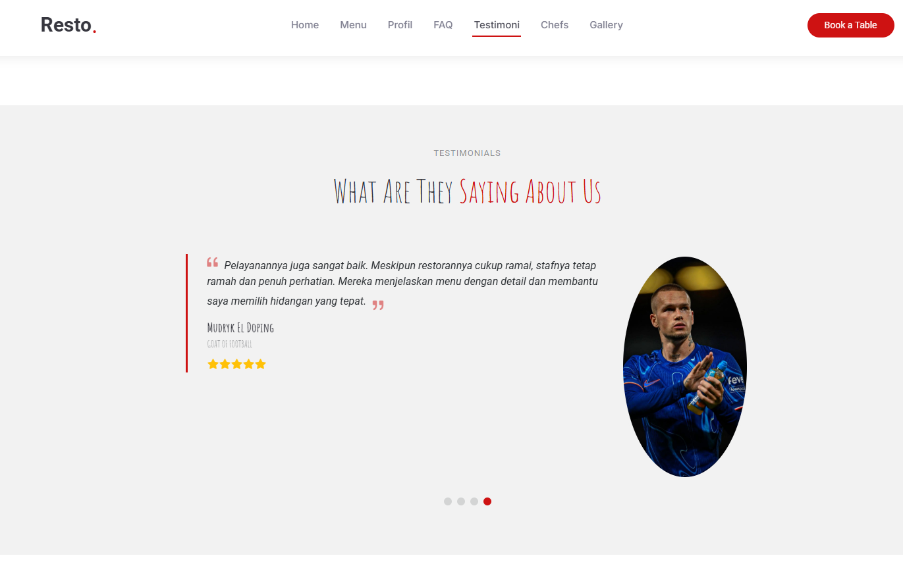
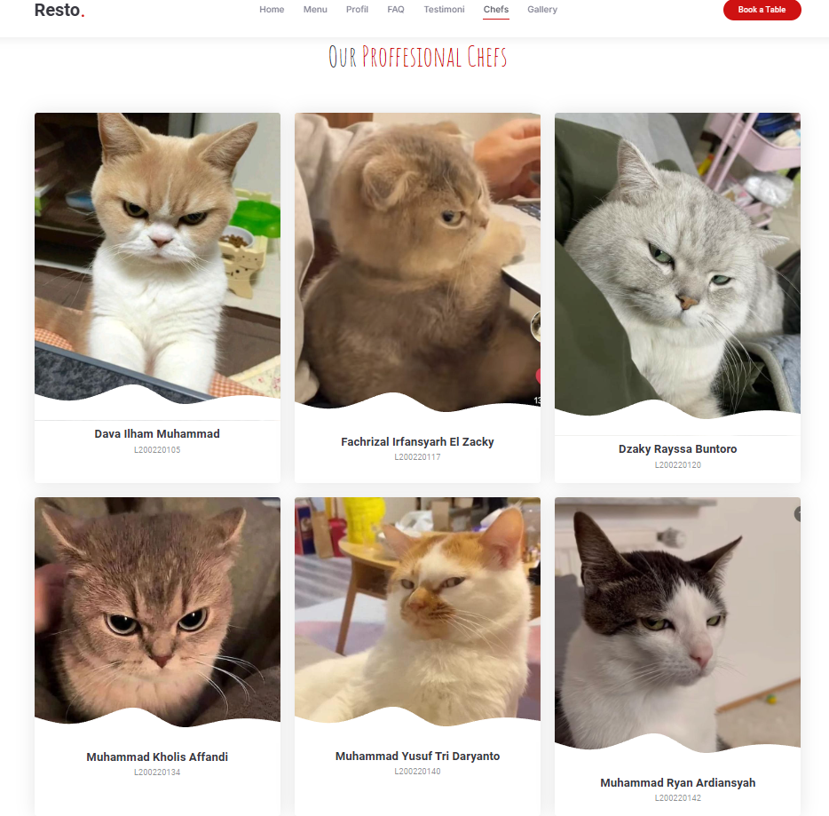
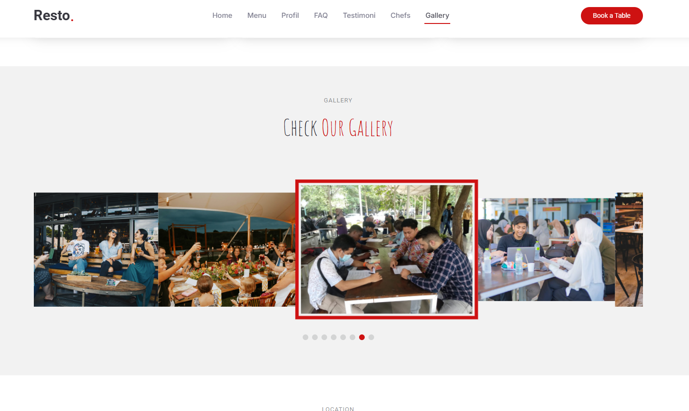

# Dokumentasi Tugas 2: Membuat Website Restoran dengan ReactJS

## Nama Kelompok: Sak Karep

## Anggota Kelompok:

| Nama Anggota                 | NIM         | GitHub Username       | Tugas                                                                         |
| ----------------------------- | ----------- | --------------------- | ----------------------------------------------------------------------------- |
| Dava Ilham Muhammad          | L200220105 | @DavaIM105           |  FAQs, Navbar, Frontend Integration, API Function |
| Fachrizal Irfansyah El Zacky | L200220117 | @L200220120Fachrizal |  Testimonials, Styling |
| Dzaky Rayssa Buntoro         | L200220120 | @dzakyray|  Menu Section, API Testing |
| Muhammad Kholis Affandi      | L200220134 | @|  Gallery Implementation |
| Muhammad Yusuf Tri Daryanto  | L200220140 | @Muhayustrid |  Backend Django, Bug Fixes, Deployment|
| Muhammad Ryan Ardiansyah     | L200220142 | @ryy142 |  Dokumentasi, Chefs, profil|

---

## Cara Menjalankan Website Restoran

### **Langkah 1: Setup dan Menjalankan Backend Server**
1. Pastikan Anda berada di direktori `server/` yang merupakan folder backend proyek ini.
   ```bash
   cd server
   ```

2. Buat **virtual environment** untuk mengisolasi dependensi:
   ```bash
   python -m venv .venv
   ```

3. Aktifkan **virtual environment**:
   - Untuk MacOS/Linux (Bash/Zsh Shell):
     ```bash
     source .venv/bin/activate
     ```
   - Untuk Windows (Command Prompt):
     ```bash
     .venv\Scripts\activate
     ```

4. Upgrade **pip** ke versi terbaru:
   ```bash
   pip install --upgrade pip
   ```

5. Install semua package yang diperlukan (terdapat di `requirements.txt`):
   ```bash
   pip install -r requirements.txt
   ```

6. Jalankan server backend:
   ```bash
   python manage.py runserver
   ```
   Server backend akan berjalan di `http://127.0.0.1:8000`.

7. (Opsional) Untuk mengakses halaman admin backend, buka `http://127.0.0.1:8000/admin` dengan kredensial berikut:
   - **Username:** `admin`
   - **Password:** `!ADqswe3pNa!8ES8`

---

### **Langkah 2: Setup dan Menjalankan Frontend Server**
1. Pindah ke direktori `website/restoran/` yang merupakan folder frontend Next.js:
   ```bash
   cd website/restoran
   ```

2. Install semua dependensi yang dibutuhkan:
   ```bash
   npm install
   ```

3. Install tambahan package untuk `swiper`:
   ```bash
   npm install swiper
   ```

4. Jalankan server frontend:
   ```bash
   pnpm run dev
   ```
   Server frontend akan berjalan di `http://localhost:3000`.

---

### **Struktur Proyek**
```
|-- server/             # Backend server menggunakan Django
|-- website/
    |-- restoran/       # Frontend server menggunakan Next.js
```

---

## Tampilan Website Restoran

### **1. Halaman Utama (Hero Section)**



### **2. Daftar Menu**



### **3. Profil**



### **4. FAQ Section**



### **5. Testimoni**



### **6. Daftar Chef**



### **7. Gallery Section**



---

## Sumber/Referensi
1. Template Frontend: [Yummy Bootstrap Template](https://bootstrapmade.com/yummy-bootstrap-restaurant-website-template/)
2. Framework:
   - Backend: **Django**
   - Frontend: **Next.js**
3. Deployment:
   - Backend: **Railway**
   - Frontend: **Vercel**

---

## Catatan
- Backend server tersedia di Railway: **[Backend URL](https://serversakkarep-production.up.railway.app/)**
- Frontend server tersedia di Vercel: **[Frontend URL](https://final-project-sakkarep.vercel.app)**
